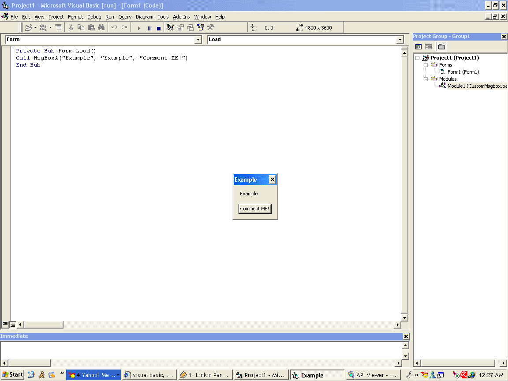



## A real custom MessageBox

### Description

Make your messagebox ok button say more than, make it say what ever you want! Example "Hello"
 
### More Info
 

             |
---                |---
**Submitted On**   |2004-06-06 11:53:12
**By**             |[\*Unknown\*](https://github.com/Planet-Source-Code/PSCIndex/blob/master/ByAuthor/unknown.md)
**Level**          |Advanced
**User Rating**    |3.3 (10 globes from 3 users)
**Compatibility**  |VB 6\.0
**Category**       |[Coding Standards](https://github.com/Planet-Source-Code/PSCIndex/blob/master/ByCategory/coding-standards__1-43.md)
**World**          |[Visual Basic](https://github.com/Planet-Source-Code/PSCIndex/blob/master/ByWorld/visual-basic.md)
**Archive File**   |[A\_real\_cus175448662004\.zip](https://github.com/Planet-Source-Code/unknown-a-real-custom-messagebox__1-54210/archive/master.zip)

